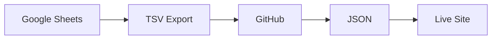

# Adding Images to Marp Presentations

## Quick Guide: Image Syntax in Marp

### 1. Basic Image Syntax

```markdown

```

### 2. Image with Size Control

```markdown


```

### 3. Background Image (Full Slide)

```markdown

```

### 4. Background with Opacity

```markdown

```

### 5. Side-by-Side Images

```markdown
 
```

---

## Step-by-Step: Adding Images to Your Presentation

### Step 1: Create Images Folder

```bash
# Create folder for images
mkdir -p docs/images

# Or organize by slide topic
mkdir -p docs/images/visualizations
mkdir -p docs/images/admin
mkdir -p docs/images/diagrams
```

### Step 2: Save Your Screenshots

**Recommended naming:**
```
docs/images/
├── viz-circle-packing.png
├── viz-dendrogram.png
├── viz-treemap.png
├── viz-sunburst.png
├── search-demo.png
├── search-filters.png
├── admin-panel.png
├── admin-review.png
├── data-flow.png
├── logo.png
└── hero-screenshot.png
```

### Step 3: Add to Presentation

```markdown
---

## Circle Packing Visualization


- Hierarchical bubbles
- Click to zoom
- See relationships at a glance

---
```

---

## Marp-Specific Image Features

### Background Images

**Full background:**
```markdown
---

<!-- _class: lead -->


# Climate Solutions Explorer

---
```

**Background with content overlay:**
```markdown
---


## Sunburst Visualization

- Radial rings
- Beautiful layout
- Interactive zoom

---
```

**Multiple backgrounds (split):**
```markdown
---


## Compare Visualizations

---
```

### Image Filters

```markdown
<!-- Blur background -->


<!-- Grayscale -->


<!-- Sepia -->


<!-- Contrast -->

```

### Image Positioning

```markdown
<!-- Left aligned -->


<!-- Right aligned -->


<!-- Fit options -->
        # Fit to slide
        # Cover entire slide
    # Contain within slide
```

---

## Practical Examples for Your Presentation

### Example 1: Visualization Slides

```markdown
---

## 1️⃣ Circle Packing


**Hierarchical bubbles** - Click to zoom and explore

---
```

### Example 2: Side-by-Side Comparison

```markdown
---

## Search Features

 

**Before filter** vs **After filter**

---
```

### Example 3: Background Image with Text

```markdown
---


## Beautiful Visualizations

- 4 different types
- Interactive exploration
- Real-time updates

---
```

### Example 4: Full-Screen Demo Slide

```markdown
---

<!-- _class: lead -->


---
```

### Example 5: Logo in Corner

```markdown
---


## Your Title Here

Content goes here...

---
```

---

## Taking Screenshots for Presentations

### Best Practices

**Resolution:**
- Use **1920x1080** browser window (or higher)
- Enable browser zoom if needed (Cmd/Ctrl + +)
- Use Retina/HiDPI if available

**Browser Developer Tools:**
```
1. Open DevTools (F12)
2. Click device toolbar (Cmd+Shift+M or Ctrl+Shift+M)
3. Select "Responsive"
4. Set to 1920 x 1080
5. Take screenshot
```

**Tools:**
- **macOS**: Cmd+Shift+4 (select area), Cmd+Shift+3 (full screen)
- **Windows**: Win+Shift+S (Snipping Tool)
- **Linux**: Flameshot, gnome-screenshot
- **Browser**: Firefox/Chrome built-in screenshot tools

### Screenshot Checklist

For **Climate Solutions Explorer** presentation:

**Visualizations:**
- [ ] Circle packing (zoomed out, showing full tree)
- [ ] Circle packing (zoomed in, showing category)
- [ ] Dendrogram (expanded view)
- [ ] Treemap (full view)
- [ ] Sunburst (full view)

**Features:**
- [ ] Search bar with example query
- [ ] Search results highlighted in red
- [ ] Filter panel open (showing options)
- [ ] Tooltip showing solution details
- [ ] Side panel with content list
- [ ] Favorites panel

**Admin (if showing):**
- [ ] Admin panel main view (blur sensitive data!)
- [ ] Pending submissions table
- [ ] Edit modal

**Diagrams (create with tool):**
- [ ] Data flow diagram
- [ ] Architecture diagram

---

## Creating Diagrams

### Option 1: Use Mermaid (Text-based diagrams)

**Install Mermaid support:**
```bash
npm install -g @mermaid-js/mermaid-cli
```

**Create diagram:**
```markdown

```

**Convert to image:**
```bash
mmdc -i diagram.mmd -o docs/images/data-flow.png
```

### Option 2: Use draw.io (Visual)

1. Go to https://app.diagrams.net/
2. Create your diagram
3. Export as PNG (File → Export as → PNG)
4. Set resolution to 300 DPI
5. Save to `docs/images/`

### Option 3: Use Excalidraw (Hand-drawn style)

1. Go to https://excalidraw.com/
2. Draw your diagram
3. Export as PNG
4. Save to `docs/images/`

---

## Example: Updated Presentation with Images

```markdown
---
marp: true
theme: uncover
paginate: true
size: 16:9
---

<!-- _class: lead -->


# Climate Solutions Explorer

---

## 🌍 The Problem


Climate solutions scattered everywhere...

---

## 💡 The Solution


**Climate Solutions Explorer**

Visualize, search, explore
1500+ climate solutions

---

## 1️⃣ Circle Packing


**Hierarchical bubbles** - Click to zoom

---

## 2️⃣ Dendrogram


**Tree structure** - Expand and explore

---

## 🔍 Powerful Search


Boolean operators, field-specific, real-time

---

## 📝 Submission Process


Submit → Review → Approve → Live (1-2 min)

---
```

---

## Image Optimization Tips

### Compress Images

```bash
# Install ImageMagick
brew install imagemagick  # macOS

# Resize and compress
convert input.png -resize 1920x1080 -quality 85 output.png

# Batch convert all PNG files
for f in images/*.png; do
  convert "$f" -quality 85 "${f%.png}-optimized.png"
done
```

### Or use online tools:
- https://tinypng.com/ (PNG compression)
- https://squoosh.app/ (Google's image optimizer)
- https://imageoptim.com/ (macOS app)

### Recommended sizes:
- **Full-width images**: 1920px width
- **Half-width images**: 900px width
- **Thumbnails**: 400-600px
- **Logos**: 200-300px
- **File size**: < 500KB per image (aim for < 200KB)

---

## Common Issues & Solutions

### Image not showing

**Problem**: Path is wrong
```markdown
<!-- Wrong -->


<!-- Correct (relative to .md file) -->

```

### Image too large

```markdown
<!-- Add width constraint -->

```

### Image quality poor

- Use higher resolution source (2x size)
- Export as PNG (not JPG for screenshots)
- Use lossless compression

### Background image doesn't fit

```markdown
<!-- Use fit or cover -->


```

---

## Quick Commands for Your Presentation

```bash
# 1. Create images folder
mkdir -p docs/images

# 2. Take screenshots and save to docs/images/

# 3. Preview presentation with images
marp docs/PRESENTATION_SHORT.md -w

# 4. Export to PDF with images
marp docs/PRESENTATION_SHORT.md --pdf -o presentation.pdf

# 5. Export to PowerPoint
marp docs/PRESENTATION_SHORT.md --pptx -o presentation.pptx
```

---

## Resources

### Image Sources
- Your live app screenshots
- Browser DevTools for responsive screenshots
- draw.io for diagrams
- Unsplash/Pexels for stock photos (CC0)

### Marp Documentation
- https://marpit.marp.app/image-syntax
- https://github.com/marp-team/marp-core/blob/main/themes/README.md

### Screenshot Tools
- Firefox: Shift+F2, then `screenshot --fullpage`
- Chrome: DevTools → Cmd+Shift+P → "Capture screenshot"
- Nimbus Screenshot (browser extension)

---

## Next Steps

1. **Take screenshots** of your live app
2. **Save to `docs/images/`** folder
3. **Update presentation** with image syntax
4. **Preview** with `marp -w` command
5. **Adjust sizes** as needed
6. **Export** final version

Need help with specific images? Let me know what you'd like to capture!
